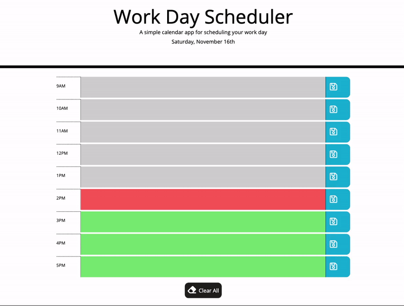

# Day Scheduler

##### A simple calendar application that allows the user to save events for each hour of the day during standard business hours.

[Link to project](https://taylormbruno.github.io/WorkDayScheduler)

## Description
The current date is listed at the top of the page inside the jumbotron.

Each row represents a certain hour and is colored based on whether it is past, present, future of current time.
* **Past** - gray
* **Present** - red
* **Future** - green

    This is where you would enter the task for that time and where the task will be held.

The blue save button will save the task in local storage so that upon refresh the task still shows in the correct hour.

The clear all button at the end of the page will clear the local storage to make it easier to begin the new day, while still being able to see the tasks from previous day.

## Built With
* HTML
* CSS
* [Bootstrap](https://getbootstrap.com/)
* JavaScript
* [jQuery](https://jquery.com/)
* [Moment.js](https://momentjs.com/)
